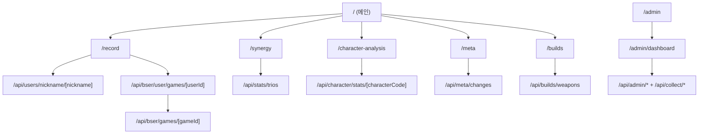

`# 페이지 구성도

현재 서비스의 Next.js App Router 기준 페이지 구성 문서입니다.

## 1) 전체 라우트 트리

```text
/
├── /landing
├── /meta
├── /builds
├── /character-analysis
├── /characters/[code]
├── /record
├── /record-no-memo
├── /synergy
├── /trio-combination
├── /duo-request
└── /admin
    └── /admin/dashboard
```

## 2) 상단 내비게이션 노출 페이지

`Navigation` 기준 상단 메뉴:
- `/` (홈)
- `/character-analysis` (캐릭터 분석)
- `/synergy` (조합 분석)

직접 URL로 접근하는 페이지:
- `/meta`, `/builds`, `/record`, `/duo-request`, `/admin/*`, `/landing`, `/record-no-memo`, `/trio-combination`, `/characters/[code]`

## 3) 페이지별 상세

### 메인/분석 페이지

| 경로 | 파일 | 역할 | 주요 호출 API |
|---|---|---|---|
| `/` | `frontend/src/app/page.tsx` | 메인 대시보드. 떡상/떡락, 티어 순위, 전역 필터 | `/api/meta/trending`, `/api/character/mithril-rp-ranking`, `/api/patches/history` |
| `/meta` | `frontend/src/app/meta/page.tsx` | 패치 간 메타 변화 히트맵/상세표 | `/api/meta/changes` |
| `/builds` | `frontend/src/app/builds/page.tsx` | 캐릭터-무기 빌드 통계 조회 | `/api/builds/weapons` |
| `/character-analysis` | `frontend/src/app/character-analysis/page.tsx` | 캐릭터 단일 상세 분석(무기/티어/패치 비교, 특성 빌드) | `/api/character/stats/[characterCode]`, `/api/builds/traits/*` |
| `/characters/[code]` | `frontend/src/app/characters/[code]/page.tsx` | 캐릭터 상세 뷰(탭 UI: 개요/빌드/상대법/조합) | `/api/character/stats/[characterCode]`, `/api/patches/history` |

### 전적/조합 페이지

| 경로 | 파일 | 역할 | 주요 호출 API |
|---|---|---|---|
| `/record` | `frontend/src/app/record/page.tsx` | 닉네임 기반 전적 검색(캐릭터 필터, 더보기) | `/api/users/nickname/[nickname]`, `/api/bser/user/games/[userId]`, `/api/bser/games/[gameId]` |
| `/record-no-memo` | `frontend/src/app/record-no-memo/page.tsx` | `record`의 성능 비교용(React.memo 미사용 실험 페이지) | `/api/users/nickname/[nickname]`, `/api/bser/user/games/[userId]`, `/api/bser/games/[gameId]` |
| `/synergy` | `frontend/src/app/synergy/page.tsx` | 1~2 캐릭터 선택 기반 3인 조합 추천 | `/api/stats/trios` |
| `/trio-combination` | `frontend/src/app/trio-combination/page.tsx` | 직업군 조합 중심 3인 추천 뷰 | `/api/stats/trios` |
| `/duo-request` | `frontend/src/app/duo-request/page.tsx` | 듀오 신청 등록/목록 조회 | `/api/duo/requests` |

### 랜딩/운영 페이지

| 경로 | 파일 | 역할 | 주요 호출 API |
|---|---|---|---|
| `/landing` | `frontend/src/app/landing/page.tsx` | 마케팅형 랜딩(서비스 소개 + CTA) | (직접 API 호출은 거의 없음) |
| `/admin` | `frontend/src/app/admin/page.tsx` | 어드민 로그인 페이지 | (클라이언트 로컬 인증 로직) |
| `/admin/dashboard` | `frontend/src/app/admin/dashboard/page.tsx` | 수집/패치 운영 화면, 수동 수집 실행 | `/api/admin/update-status`, `/api/admin/patches`, `/api/collect/periodic`, `/api/collect/historical` |

## 4) 사용자 흐름 구성도



## 5) 운영 시 참고 메모

- 실제 핵심 진입 페이지는 `/`, `/record`, `/character-analysis`, `/synergy`입니다.
- `/record-no-memo`, `/trio-combination`, `/landing`은 성격상 실험/보조 페이지 성격이 강합니다.
- Admin 기능은 `/admin/dashboard`에 집중되어 있으며, 수집 파이프라인 운영의 중심입니다.
