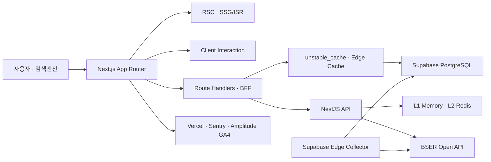

<div align="center">

# ER&GG — 이리와지지

**실사용 지표와 성능 계측을 바탕으로 운영하는 이터널리턴 메타 분석 서비스**

[](https://nextjs.org/)
[](https://react.dev/)
[](https://www.typescriptlang.org/)
[](https://nestjs.com/)
[](https://supabase.com/)

**[서비스 바로가기](https://erwagg.com)** · **[GitHub](https://github.com/BellYun)**

</div>

---

## 프로젝트 소개

ER&GG는 이터널리턴의 패치·티어별 통계를 수집하고, 여러 조건의 캐릭터 성과와 3인 조합을 비교·분석하는 웹 서비스입니다.

단순한 토이 프로젝트가 아니라 실제 사용자의 피드백과 운영 지표를 기반으로 개선하고 있습니다. 기획, 데이터 모델링, 프론트엔드와 백엔드, 배포, 모니터링까지 전 과정을 1인 개발로 담당했습니다.

| 항목        | 내용                                                              |
| ----------- | ----------------------------------------------------------------- |
| 개발 기간   | 2026.03 ~ 현재                                                    |
| 개발 형태   | 개인 프로젝트 · 1인 개발 및 운영                                  |
| 담당 범위   | 제품 기획, UI, Frontend, Backend, DB, 데이터 수집, 배포, 모니터링 |
| 서비스 규모 | 최고 DAU 1,300                                                    |
| 지원 언어   | 한국어 · 영어 · 일본어                                            |
| 현재 데이터 | 패치 10.1 ~ 11.7                                                  |

## Key Results

| 영역           | 결과                                        | 설계·검증 기준                              |
| -------------- | ------------------------------------------- | ------------------------------------------- |
| 서비스 운영    | **최고 DAU 1,300**                          | Vercel Analytics                            |
| DB 조회 최적화 | 대표 조회 기준 DB row 수 **약 85% 감소**    | canonical key 기반 사전 집계 · 조회 인덱스  |
| API 응답 성능  | 평균 응답시간 **약 51% 단축**               | 요청 시 원본 집계에서 사전 집계 조회로 전환 |
| 비교 UX        | URL 공유·새로고침 상태 복원, 요청 경쟁 방지 | URL 직렬화 · AbortController                |
| 품질 관리      | E2E·접근성 검증을 **PR 필수 체크**로 구성   | Playwright · axe-core · GitHub Actions      |

> 수치는 실제 서비스 운영 및 대표 조회 시나리오에서 측정한 값입니다. DB row 수와 응답시간 개선율은 3인 조합 대표 조회를 기준으로 합니다.

## 주요 기능

| 기능              | 사용자 가치                                                    |
| ----------------- | -------------------------------------------------------------- |
| 캐릭터 티어표     | 패치·티어별 승률, 픽률, 평균 RP를 종합해 메타를 빠르게 파악    |
| 캐릭터 상세 분석  | 무기, 장비, 특성, 조합 통계를 한 페이지에서 비교               |
| 3인 조합 분석     | 비교 조건, 최소 표본 필터, 소표본 안내를 제공하는 조합 탐색    |
| 캐릭터 연구소     | 역할군별 성과와 포지션 메타를 비교                             |
| 패치 분석         | 이전 패치 대비 지표 변화와 밸런스 변경사항 확인                |
| 플레이어 멀티서치 | 닉네임별 시즌 통계와 주력 캐릭터 기반 팀 조합 추천             |
| 공유 기능         | 선택한 조합을 URL 상태와 동적 OG 이미지로 공유                 |
| 다국어 서비스     | 한국어, 영어, 일본어 locale 라우팅과 검색엔진별 대체 링크 제공 |

## System Architecture



> **Backend scope:** NestJS 서버는 서비스 초기 단계에서 BSER API 연동, 멀티서치, Redis 캐시 구조를 빠르게 검증하기 위해 구현한 초기 검증용 백엔드입니다.

- 조회 중심 페이지는 Server Component와 정적 생성을 활용해 초기 HTML과 SEO 표면을 확보합니다.
- 필터, 검색, 터치 선택, 모달처럼 상호작용이 필요한 영역만 Client Component로 분리합니다.
- 통계 API는 Next.js 서버 캐시, CDN/브라우저 HTTP 캐시, NestJS Redis를 데이터 휘발성에 따라 조합합니다.
- 데이터 수집과 사용자 요청의 BSER API 예산을 분리해 외부 API 제한 안에서 운영합니다.

## Engineering Highlights

### 1. 복합 통계 비교 UX와 브라우저 기반 품질 자동화

**문제**

패치, 티어, 캐릭터, 무기처럼 비교 조건이 많은 화면에서 상태를 컴포넌트 내부에만 두면 공유 링크와 새로고침 시 조건이 사라집니다. 사용자가 필터를 연속으로 변경할 때 먼저 시작한 요청이 나중에 완료되면 최신 결과를 이전 응답이 덮어쓸 수도 있었습니다.

**해결**

- 비교 조건을 URL query parameter에 직렬화해 공유 및 새로고침 시 동일한 상태를 복원했습니다.
- URL을 비교 상태의 단일 진실 공급원으로 사용해 화면 상태와 공유 주소가 어긋나지 않도록 했습니다.
- 필터가 바뀔 때 이전 요청을 `AbortController`로 취소해 늦게 도착한 응답이 최신 결과를 덮어쓰는 요청 경쟁을 방지했습니다.
- 최소 표본 기준과 소표본 안내를 제공해 사용자가 승률이나 RP를 표본 수와 함께 해석하도록 설계했습니다.
- Playwright로 비교 조건 복원과 핵심 탐색 흐름을 검증하고, axe-core로 주요 페이지의 접근성 회귀를 검사했습니다.

**결과**

- 사용자가 비교 조건을 그대로 저장·공유할 수 있고, 빠른 조건 변경에서도 마지막 선택에 해당하는 결과만 화면에 남도록 했습니다.
- Playwright·axe 기반 E2E 검증을 PR 필수 체크로 구성해 주요 사용자 경로의 회귀를 병합 전에 차단했습니다.

### 2. 모바일 상호작용 성능과 INP 회귀 차단

**문제**

3인 조합 화면은 캐릭터·무기 선택 항목과 결과 카드가 많고, API 응답 직후 여러 카드가 갱신됩니다. 모바일 환경에서 이 렌더링과 사용자의 다음 터치가 겹치면 이벤트 처리 시간이 길어져 조합을 연속으로 탐색할 때 반응성이 떨어질 수 있었습니다.

**해결**

- 캐릭터·무기 선택 그리드와 조합 결과 목록에 TanStack Virtual을 적용해 화면에 필요한 항목만 렌더링했습니다.
- `ResizeObserver`로 펼침 가능한 카드의 실제 높이를 측정해 가상 목록의 위치 계산에 반영했습니다.
- 즉시 보여야 하는 토글 피드백과 무거운 상세 패널 렌더링을 분리하고, 상세 렌더링은 `startTransition`으로 처리했습니다.
- Playwright에서 390×844 모바일 터치 환경과 CPU 6배 제한을 재현하고, 실제 캐릭터 선택 흐름의 interaction duration을 반복 측정했습니다.
- 5회 실행 결과의 p95가 250ms 성능 예산을 초과하면 GitHub Actions가 실패하도록 INP 성능 게이트를 구성했습니다.

**결과**

- 긴 선택 목록과 결과 목록에서 동시에 마운트되는 컴포넌트 수를 제한하면서, 상세 카드의 동적 높이도 안정적으로 반영했습니다.
- 모바일 핵심 탐색 흐름의 상호작용 성능을 정량적으로 확인하고, 성능 예산을 넘는 회귀를 PR 단계에서 탐지할 수 있게 했습니다.

### 3. 데이터 변경 주기에 따른 페이지·API 캐시 정책

**문제**

캐릭터 상세, 메인 대시보드, 공개 통계 API는 데이터 변경 주기와 접근 패턴이 서로 다릅니다. 모든 경로에 같은 렌더링·캐시 정책을 적용하면 정적 페이지의 캐시 효율을 놓치거나 변경된 통계가 오래 남을 수 있었습니다.

**설계**

- 88개 캐릭터 상세 페이지는 `generateStaticParams`로 정적 생성하고, 메인 페이지는 ISR로 분리했습니다.
- 공개 통계는 변경 주기에 따라 Next.js Data Cache와 CDN `Cache-Control` 정책을 다르게 적용했습니다.
- 종료 패치, 패치 목록, 캐릭터 통계, 조합 통계를 캐시 프리셋으로 분류해 Browser·CDN·SWR 정책을 표준화했습니다.
- 3인 캐릭터 조합은 순서와 무관한 canonical key로 정규화해 동일 조합의 집계와 캐시를 재사용했습니다.
- 데이터 수집 이후 tag-based invalidation을 수행해 긴 TTL에서도 갱신 시점을 제어했습니다.

**결과**

- 데이터 변경 주기와 요청 특성에 맞는 캐시 경계를 적용하고, 조합 순서만 다른 중복 집계를 제거했습니다.

관련 문서: [조합 API 캐싱 설계](blog-trios-caching.md) · [Next.js 캐싱 전략](caching.md)

### 4. 3인 조합 탐색을 위한 사전 집계 구조

**문제**

여러 3인 조합을 비교하는 기능에서 요청마다 원본 매치 로그를 집계했습니다. 데이터가 늘어날수록 조회 row 수와 집계 비용이 함께 커져 조합 탐색의 응답시간이 증가했습니다.

**해결**

- 세 캐릭터의 순서를 정렬한 canonical key를 기준으로 조합을 한 번만 사전 집계했습니다.
- 단일 캐릭터, 캐릭터 쌍, 3인 조합 조회 패턴에 맞는 검색 테이블과 인덱스를 구성했습니다.
- API에서는 원본 로그를 다시 집계하지 않고 canonical key 기반 집계 결과를 조회하도록 변경했습니다.
- 같은 조합의 순서만 다른 요청은 동일한 집계와 캐시를 재사용하도록 정규화했습니다.

**결과**

대표 조회 기준으로 DB 조회 row 수를 **약 85%**, 평균 응답시간을 **약 51%** 줄였습니다.

### 5. 일본 사용자 진입을 위한 locale 기반 라우팅·SEO

**문제**

일본 사용자가 기존 한국어 페이지로 유입되고 있었지만 핵심 기능 사용으로 이어지는 비율이 낮았습니다. UI 번역만 바꾸는 방식으로는 일본어 화면을 공유하거나 검색엔진이 독립된 진입 경로로 색인하기 어려웠습니다.

**해결**

- URL을 locale 상태의 기준으로 삼고 `next-intl` 기반 locale 라우팅을 도입했습니다.
- 기존 한국어 URL은 rewrite로 유지해 기존 링크와 검색 유입이 깨지지 않도록 했습니다.
- 일본어에는 `/ja` 경로를 제공해 같은 상세 화면을 일본어 URL로 직접 공유할 수 있게 했습니다.
- 일본어 페이지마다 self-canonical을 설정하고, 한국어·일본어 `hreflang`과 sitemap을 구성했습니다.

**결과**

- 기존 한국어 경로의 호환성을 유지하면서 일본 사용자가 검색·공유로 직접 진입할 수 있는 독립 URL 구조를 만들었습니다.
- URL 단위로 locale별 유입과 핵심 기능 사용을 분석할 수 있는 기반을 마련했습니다.

[일본 사용자 유입을 실제 사용으로 연결하기 위한 다국어 SEO 개선기](https://medium.com/@whd3558/%EC%9D%BC%EB%B3%B8-%EC%82%AC%EC%9A%A9%EC%9E%90-%EC%9C%A0%EC%9E%85%EC%9D%84-%EC%8B%A4%EC%A0%9C-%EC%82%AC%EC%9A%A9%EC%9C%BC%EB%A1%9C-%EC%97%B0%EA%B2%B0%ED%95%98%EA%B8%B0-%EC%9C%84%ED%95%9C-%EB%8B%A4%EA%B5%AD%EC%96%B4-seo-%EA%B0%9C%EC%84%A0%EA%B8%B0-468a345f6f7e)

## Tech Stack

| 영역              | 기술                                                        |
| ----------------- | ----------------------------------------------------------- |
| Frontend          | Next.js 16.2, React 19.2, TypeScript 5, next-intl 4         |
| UI                | Tailwind CSS v4, CSS Variables, Recharts, TanStack Virtual  |
| Backend           | NestJS 11, Node.js, TypeScript                              |
| Data              | Supabase PostgreSQL, Supabase Edge Functions, BSER Open API |
| Cache             | Next.js Server Cache, CDN/Browser HTTP Cache, Redis         |
| Testing           | Vitest, Playwright, axe-core                                |
| Observability     | Vercel Analytics, Vercel Observability, Sentry, Web Vitals  |
| Product Analytics | Amplitude, Google Analytics 4, Google Search Console        |
| Quality           | ESLint 9, Prettier, Husky, lint-staged, GitHub Actions      |
| Desktop           | Electron 36, Vite 6, Windows NSIS                           |

## Repository Structure

```text
ERMeta/
├── frontend/
│   ├── src/app/(site)/[locale]/   # ko/en/ja 페이지와 Server Components
│   ├── src/app/api/               # BFF, 통계 API, 캐시 무효화
│   ├── src/components/features/   # 티어, 캐릭터, 조합 도메인 UI
│   ├── src/lib/                   # 데이터 접근, 캐시, 분석, analytics
│   ├── messages/                  # locale 번역 리소스
│   ├── e2e/                       # Playwright smoke/flow/a11y
│   └── scripts/                   # 성능 계측과 데이터 작업
├── backend/                       # NestJS API, Redis, 수집·가공
├── supabase/                      # Edge Functions
├── desktop/                       # Electron 데스크톱 클라이언트
├── knowledge/eternal-return/      # 게임·데이터·커뮤니티 도메인 지식
├── DATA/                          # 통계 분석 자료
└── docs/                          # 아키텍처와 운영 문서
```

## Getting Started

### Prerequisites

- Node.js >= 20.9.0
- npm
- 전체 데이터 기능 사용 시 Supabase 프로젝트와 BSER API Key
- NestJS 멀티서치 캐시 사용 시 Redis

### Frontend

```bash
git clone https://github.com/BellYun/ERMeta.git
cd ERMeta
cd frontend
npm ci
cp .env.example .env.local
npm run dev
# http://localhost:3000
```

```bash
npm run lint       # ESLint
npm run test       # Vitest
npm run test:e2e   # Playwright
npm run build      # Production build
```

### Backend

저장소 루트에서 실행합니다.

```bash
cd backend
npm ci
cp .env.example .env
npm run start:dev
# http://localhost:4000
```

환경 변수의 기본 설정은 [`frontend/.env.example`](frontend/.env.example)과 [`backend/.env.example`](backend/.env.example)을 참고하세요.

## Technical Notes

- [Frontend E2E 가이드](frontend/e2e/README.md)
- [조합 통계 API 캐싱](blog-trios-caching.md)
- [Next.js 캐싱 전략](caching.md)
- [RSC 최적화](RSC-optimization.md)
- [API 캐시 정규화 설계](docs/API_CACHE_NORMALIZATION_PLAN_FRONTEND.md)

## License

Private — All rights reserved.

---

<div align="center">

**[erwagg.com](https://erwagg.com)**

_이터널리턴, 데이터로 이기자._

</div>
